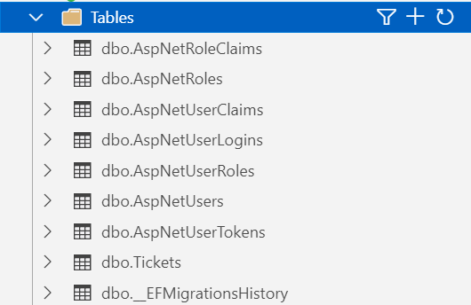
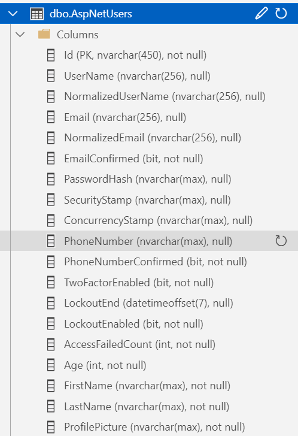

# ExtendedUserApp

Ovaj repozitorij se sastoji od primjera za proširivanje `IdentityUser` klase u ASP.NET projektu. Tutorijal sličan urađenom primjeru se može naći na [ovom linku](https://www.tektutorialshub.com/asp-net-core/add-custom-fields-to-user-in-asp-net-core-identity/).

U modelu su kreirane 2 klase:
- `ApplicationUser` klasa koja nasljeđuje `IdentityUser` klasu
- `Ticket` klasa koja sadrži atribut tipa `ApplicationUser`

Koraci za kreiranje:
1. Provjeriti da li je konekcijski string pravilno unesen u `appsettings.json` i da li je baza podataka kreirana i aktivna
2. Kreirati `ApplicationUser` klasu nasljeđujući je iz `IdentityUser` klase 
3. Kreirati ostale modelske klase
3. Napraviti neophodne izmjene u `ApplicationDbContext` klasi
4. Primijeniti default-nu incijalizaciju identiteta u `Program` klasi
5. Napraviti migraciju i uraditi update baze podataka u `Package Manager` konzoli

Stanje baze podataka nakon migracije:  

Detaljno objašnjenje kreiranje modela i migracije na bazu podataka se nalazi u vježbi 5.
